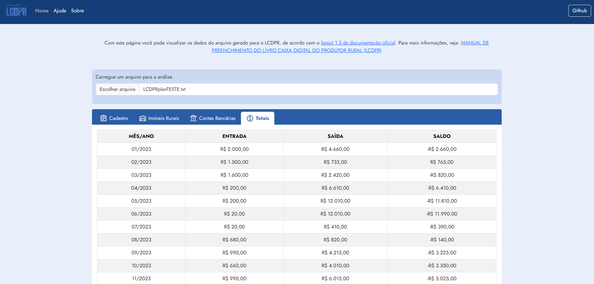

# 📊 LCDPR - Analisador de Dados

O LCDPR (Livro Caixa Digital do Produtor Rural) é uma parte crucial da gestão financeira para muitos produtores rurais, mas nem sempre é fácil visualizar e validar os dados contidos nesses arquivos, especialmente após edições manuais.

Para resolver esse desafio, desenvolvi um Analisador do LCDPR, uma ferramenta que simplifica a visualização e verificação desses dados de forma clara e acessível. Com esse analisador, você pode carregar facilmente um arquivo LCDPR e gerar relatórios que destacam os totalizadores mensais e o total anual, permitindo uma verificação rápida da integridade dos dados.

O objetivo deste projeto é proporcionar aos produtores rurais e profissionais contábeis uma maneira eficiente de validar e visualizar os dados do LCDPR após alterações manuais, preenchendo uma lacuna importante na gestão financeira digital do setor agrícola.

Se você trabalha com o LCDPR ou está interessado em ferramentas de gestão financeira para o setor agrícola, confira o projeto e contribua com suas ideias e sugestões! Juntos, podemos simplificar e otimizar a gestão financeira para os produtores rurais. 💼🌾

## 📝 Sobre

O objetivo desse projeto é visualizar os dados do arquivo gerado para o LCDPR, de acordo com o [layout 1.3 da documentação oficial](https://www.gov.br/agricultura/pt-br/assuntos/politicas-e-programas/programa-de-substituicao-da-agricultura-por-cafe-de-qualidade-psaq).

Essa solução surgiu a partir do trabalho da geração do LCDPR, que é gerado a partir de um software de gerenciamento empresarial, onde foram acumulados ao longo do ano base, os lançamentos contábeis que serão inclusos no livro. Após a extração dos dados, ainda é necessário fazer ajustes manuais diretamente no arquivo que será enviado para a Receita Federal, pois são muitas parametrizações que precisam estar corretas para que nenhuma informação seja erronea.

Assim, o Analisador pode ler esse arquivo após as alterações necessárias, para verificar a integridade das informações, principalmente dos valores mensais e anuais, que são calculados de acordo com cada registro, e não considerando os totalizadores que já estão no arquivo, para que possa ser feita essa comparação.

O e-CAC disponibiliza um analisador, mas que não verifica e nem exibe as informações, apenas exibe os erros no arquivo, de layout ou dados, trazendo uma utilidade real para essa aplicação.

Para mais informações, veja: [MANUAL DE PREENCHIMENTO DO LIVRO CAIXA DIGITAL DO PRODUTOR RURAL (LCDPR)](https://www.gov.br/agricultura/pt-br/assuntos/politicas-e-programas/programa-de-substituicao-da-agricultura-por-cafe-de-qualidade-psaq/arquivos/manual-lcdpr-2022-08-05-v1.0.pdf).

## 🚀 Uso

1. Acesse a página [Analisador LCDPR](https://gabrielsouzas.github.io/analisador-lcdpr/) em seu navegador.
2. Clique no botão "Escolher arquivo".
3. Selecione o arquivo LCDPR que deseja visualizar.
4. Os dados serão exibidos na página.

## 🎯 Funcionalidades

- Visualização de dados do arquivo LCDPR.
- Cálculo de totais.

## 🛠️ Tecnologias

- HTML5
- CSS3
- JavaScript
- [Bootstrap](https://getbootstrap.com/)

## 🤝 Contribuições

Contribuições são bem-vindas! Abra um problema ou um pedido de pull request se você tiver alguma sugestão.
